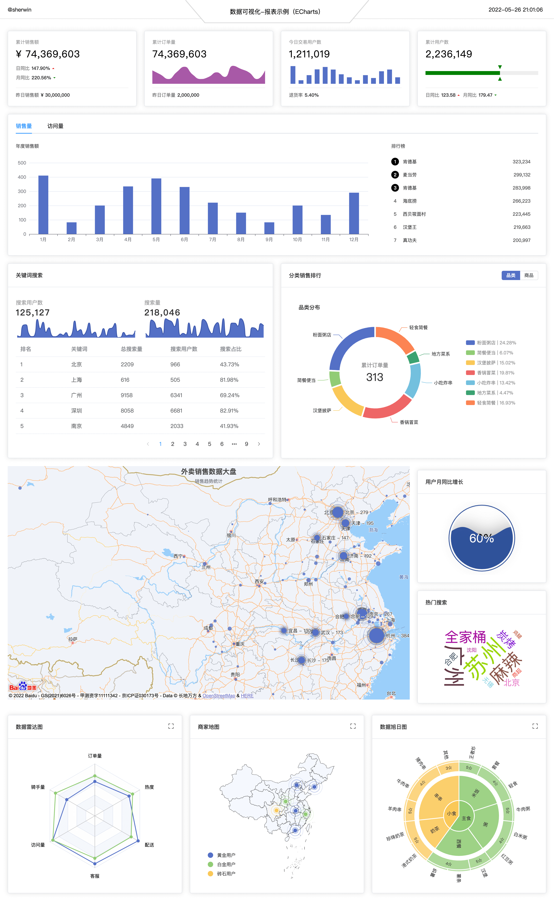

# 数据可视化 - 报表项目

> 项目主要参考自[实战「慕课外卖」数据大屏](http://www.youbaobao.xyz/datav-docs/)，更多内容请移步 👉 [数据可视化之入门指南](https://www.yuque.com/sherwin-sw/fe/data-visualization)。

- Vue3 + TS

- ECharts
  
  - vue-echarts（ECharts 的 Vue 组件）
  - echarts-liquidfill（水球图）
  - echarts-wordcloud（词云图）

- Element-plus

---

如果发现本项目有错误，欢迎提交 issues 指正，也可联系邮箱 [sherwin_sw@163.com](mailto:sherwin_sw@163.com)。
